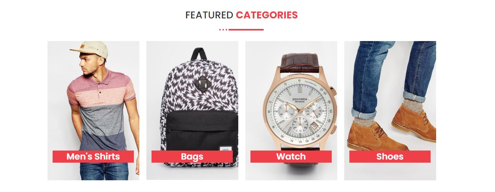
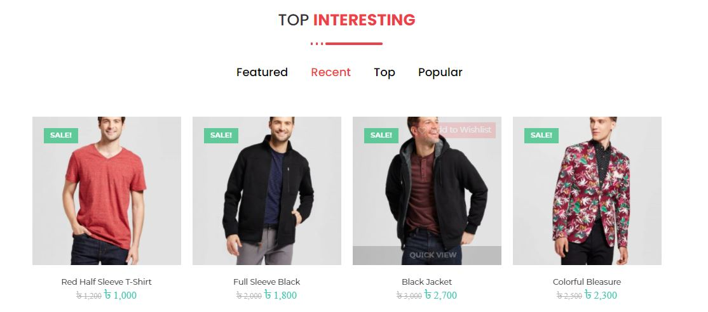
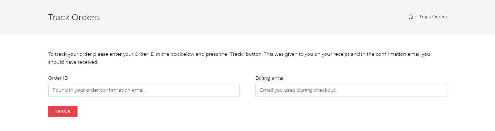
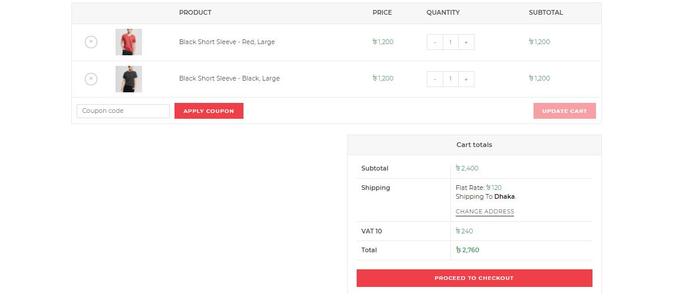
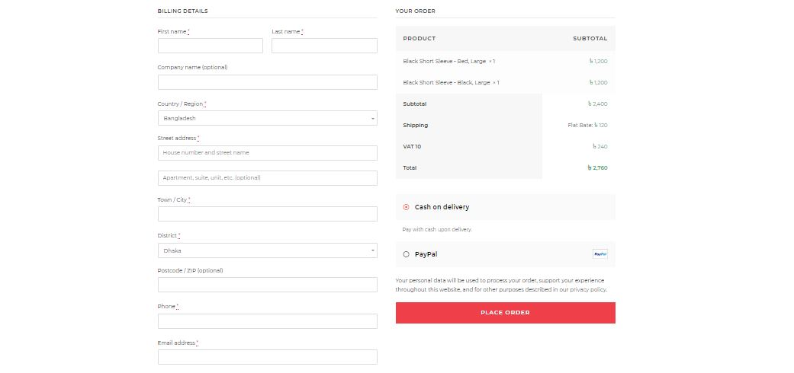
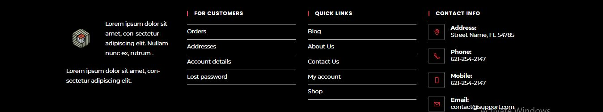
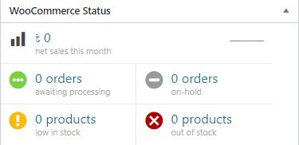

<h2>WordPress WooCommerce Website</h2>
 
<h3>Some screenshots</h3>
 

<b>1. Header Section</b>

 

<b>2. Featured Categories Section</b>

 

<b>3. Top Interesting Section<b>

 

<b>4. Products filtering by color and size</b>

 

<b>5. Order Tracking Section</b>

 

<b>6. Cart Section</b>

 

<b>7. Place Order Section</b>

 

<b>8. Footer Section</b>

 

<b>9. Woocommerce Dashboard Section</b>

 

